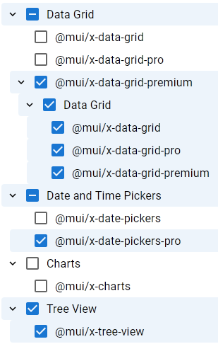

# MUI-X Tree View with Parent/Child Relationship and Indeterminate Checkboxes

I needed this functionality for a project where our team uses MUI, so I wanted to share a minimal example of my implementation. It requires some saved state to share between the tree and the items, and a way to programmatically add parents to the items.

Inspired by:

- [Selectable Tree view](https://github.com/mui/mui-x/issues/12802#issuecomment-2060650470) by [@michelengelen](https://github.com/michelengelen)
- [MUI Rich Tree View - Customization - Common examples](https://mui.com/x/react-tree-view/rich-tree-view/customization/#common-examples)
- [MUI Rich Tree View - Selection - Parent/children relationship](https://mui.com/x/react-tree-view/rich-tree-view/selection/#parent-children-selection-relationship)

MUI-X Issues:

- [Support parent / children selection relationship](https://github.com/mui/mui-x/issues/12883)
- [How to have Selectable Tree component](https://github.com/mui/mui-x/issues/12802)
